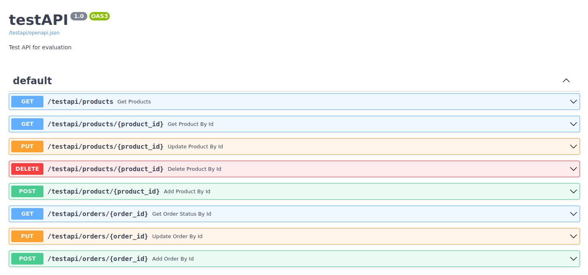
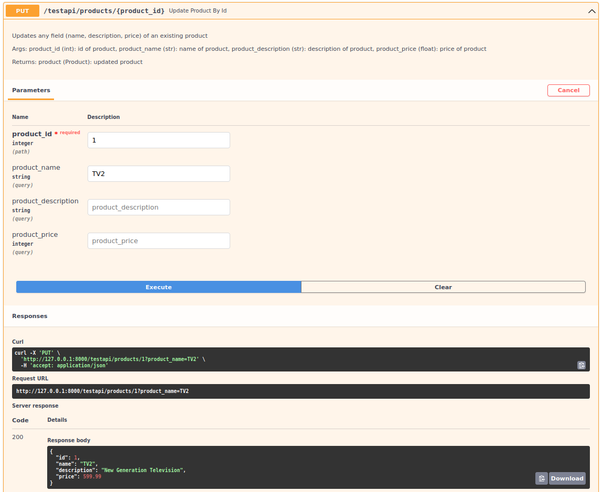

# Test API in python 

## Installation:
Install the python packages in the requirements.txt 
```
pip install -r requirements.txt
```

## How-to run:
In the same directory, run the following command
```
uvicorn app:app --reload
```
Once application startup is completed, a url is printed on the terminal (e.g., INFO: Uvicorn running on http://127.0.0.1:8000) 

example url: http://127.0.0.1:8000/

Go to **url**: http://127.0.0.1:8000/testapi/docs 

*url might be different on each device, general rule: url/testapi/docs*

## How-to use:
In the (**url**), there is the following interface where you can 




By adding values in the corresponding fields you can do all needed operations:

